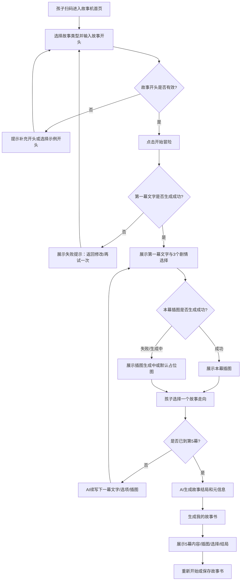
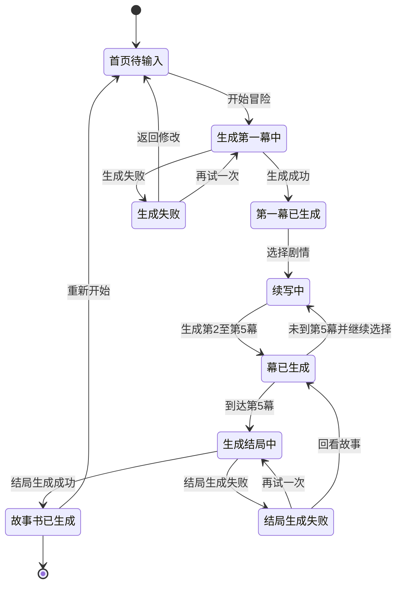
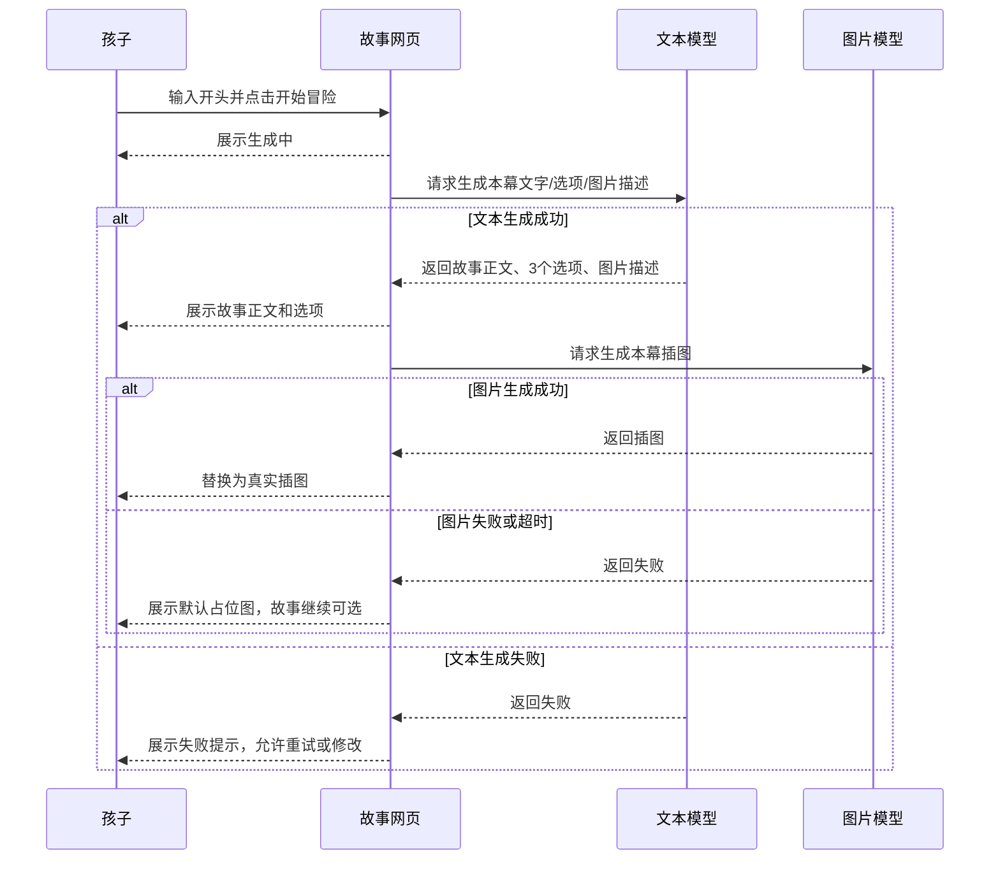

# 产品需求文档：AI 互动故事冒险机 - V0.1

## 1. 综述 (Overview)

### 1.1 项目背景与核心问题

本项目面向小学高年级到初中生，目标是在社区活动中让孩子以“玩故事”的方式体验 AI，而不是把 AI 应用做成单纯学习工具。用户希望孩子通过兴趣进入 AI：输入一个故事开头，AI 续写剧情，每一幕给出选择，孩子通过选择推动故事发展，最终生成一本带插图的故事书。

核心问题是：纯文字互动容易枯燥，孩子缺少持续参与感；单纯生成故事又缺少“我参与创作”的成就感。因此第一版产品要把“互动选择”和“每幕插图”作为核心体验，让孩子能看到自己的选择如何影响故事，并在结尾得到可展示的故事作品。

### 1.2 核心业务流程 / 用户旅程地图

1. **进入故事机** - 孩子扫码打开手机网页，进入一个偏游戏化的故事冒险首页。
2. **输入故事开头** - 孩子输入文字故事开头；语音入口可保留但第一版不强制实现真实语音识别。
3. **生成故事第一幕** - AI 基于开头和故事类型生成第一幕故事、3 个剧情选择和本幕插图。
4. **选择故事走向** - 孩子点击 3 个选项中的一个，决定下一幕发展。
5. **持续互动接龙** - 系统记住前文和孩子选择，继续生成下一幕文字、选项和插图，固定推进到第 5 幕。
6. **生成故事结局** - 第 5 幕完成后，AI 生成完整结局、标题、主角、关键选择和结局类型。
7. **生成故事书** - 系统收集 5 幕内容、每幕插图、孩子选择和结局，形成“我的故事书”页面。
8. **新项目独立开发** - 新故事项目放在 `story-adventure/` 目录下，不移动、不删除旧学习卡片项目。

### 1.3 Mermaid 图（流程/状态/时序）

#### 1.3.1 用户操作流（必填）



#### 1.3.2 状态机（故事会话状态）



#### 1.3.3 关键场景时序（图片生成不阻断故事）



## 2. 用户故事详述 (User Stories)

### 阶段一：进入故事并发起冒险

---

#### **US-01: 作为孩子，我希望扫码进入故事机并输入一个故事开头，以便开始一次属于自己的 AI 故事冒险。**

* **价值陈述 (Value Statement)**:
  * **作为** 小学高年级到初中生
  * **我希望** 通过文字输入一个故事开头，并选择故事类型
  * **以便于** 快速开始一次由我参与推动的 AI 故事冒险

* **业务规则与逻辑 (Business Logic)**:
  1. **前置条件**: 孩子已通过二维码或链接打开手机网页。
  2. **操作流程 (Happy Path)**:
     1. 页面展示游戏化首页，标题为“AI 互动故事冒险机”。
     2. 页面提供故事类型按钮：奇幻、校园、科幻、侦探、搞笑，默认选中“奇幻”。
     3. 页面提供故事开头输入框，提示孩子可以输入很短的开头。
     4. 页面提供 2-3 个示例开头，点击后自动填入输入框。
     5. 孩子输入不少于 3 个字后，点击“开始冒险”。
     6. 系统进入生成第一幕状态。
  3. **异常处理 (Error Handling)**:
     * 输入少于 3 个字时，提示“请先写一个故事开头”，并停留在首页。
     * 第一版若未实现真实语音识别，点击语音按钮时提示“语音输入将在下一版支持，请先使用文字输入”。
     * 示例开头点击失败时，不影响手动输入。

* **验收标准 (Acceptance Criteria)**:
  * **场景1: 成功输入故事开头**
    * **GIVEN** 孩子打开故事机首页
    * **WHEN** 输入“我在学校储物柜里发现了一张会发光的地图”并点击“开始冒险”
    * **THEN** 系统应进入故事生成中状态，并保留孩子输入的故事开头
  * **场景2: 输入太短**
    * **GIVEN** 孩子打开故事机首页
    * **WHEN** 输入少于 3 个字并点击“开始冒险”
    * **THEN** 页面应提示“请先写一个故事开头”，并停留在首页
  * **场景3: 点击示例开头**
    * **GIVEN** 孩子打开故事机首页
    * **WHEN** 点击示例开头“会说话的猫”
    * **THEN** 输入框应自动填入对应完整开头
  * **场景4: 点击语音输入但第一版未启用**
    * **GIVEN** 第一版尚未支持真实语音识别
    * **WHEN** 孩子点击“语音输入”
    * **THEN** 页面应提示“语音输入将在下一版支持，请先使用文字输入”

---

* **页面布局线框图 (ASCII Wireframe)**:

```text
+--------------------------------------+
| AI 互动故事冒险机                    |
| 说一个开头，让 AI 陪你把故事玩下去   |
+--------------------------------------+
| 故事类型                              |
| [ 奇幻 ] [ 校园 ] [ 科幻 ]            |
| [ 侦探 ] [ 搞笑 ]                    |
|                                      |
| 故事开头                              |
| +----------------------------------+ |
| | 例如：我在储物柜里发现了...       | |
| |                                  | |
| +----------------------------------+ |
|                                      |
| 示例开头                              |
| 1. 会发光的地图                      |
| 2. 会说话的猫                        |
| 3. 绿色的天空                        |
|                                      |
|             [ 语音输入 ]             |
|                                      |
| [ 开始冒险 ]                         |
+--------------------------------------+
```

---

### 阶段二：生成第一幕

---

#### **US-02: 作为孩子，我希望 AI 根据我的故事开头生成第一幕故事和插图，以便马上进入一个有画面感的冒险。**

* **价值陈述 (Value Statement)**:
  * **作为** 孩子
  * **我希望** AI 生成第一幕故事、插图和剧情选择
  * **以便于** 我能像看互动漫画书一样开始冒险

* **业务规则与逻辑 (Business Logic)**:
  1. **前置条件**: 孩子已输入有效故事开头，并选择故事类型。
  2. **操作流程 (Happy Path)**:
     1. 孩子点击“开始冒险”后，页面展示“正在打开故事传送门...”。
     2. 文本模型生成第一幕正文、3 个剧情选择和图片描述。
     3. 第一幕正文建议 120-200 字，包含角色、场景、冲突或悬念。
     4. 图片模型根据图片描述生成本幕插图。
     5. 页面展示第 1 幕、故事正文、插图和 3 个选择。
  3. **异常处理 (Error Handling)**:
     * 文本生成失败时，展示失败页，支持“返回修改”和“再试一次”。
     * 文本返回内容不完整，如缺少 3 个选择，视为生成失败。
     * 图片生成失败或被安全策略拦截时，展示默认占位图，故事仍可继续。
     * 故事内容不得包含血腥、成人、违法、明显恐吓儿童的内容。

* **验收标准 (Acceptance Criteria)**:
  * **场景1: 成功生成第一幕**
    * **GIVEN** 孩子已输入有效故事开头并选择故事类型
    * **WHEN** 点击“开始冒险”
    * **THEN** 系统应展示第一幕故事、一张插图和 3 个可点击剧情选择
  * **场景2: 生成中状态**
    * **GIVEN** 孩子点击“开始冒险”
    * **WHEN** AI 尚未返回结果
    * **THEN** 页面应展示生成中状态，并避免孩子重复提交
  * **场景3: AI 生成失败**
    * **GIVEN** 孩子点击“开始冒险”
    * **WHEN** AI 服务失败或返回内容不完整
    * **THEN** 页面应展示失败提示，并提供“返回修改”和“再试一次”
  * **场景4: 图片失败兜底**
    * **GIVEN** 第一幕文字和选项已生成成功
    * **WHEN** 插图生成失败
    * **THEN** 页面应展示默认占位图，剧情选择仍可点击

---

* **页面布局线框图 (ASCII Wireframe)**:

```text
+--------------------------------------+
| 第 1 幕 / 共 5 幕                    |
| 类型：奇幻                           |
+--------------------------------------+
| 标题：会发光的地图                   |
+--------------------------------------+
| 我在学校储物柜里发现了一张会发光的   |
| 地图。地图上的路线像小蛇一样移动。   |
|                                      |
| +----------------------------------+ |
| |                                  | |
| |        本幕插图 / 占位图          | |
| |                                  | |
| +----------------------------------+ |
|                                      |
| 你要怎么做？                         |
| [ A. 立刻去旧钟楼看看 ]              |
| [ B. 找最好的朋友一起研究 ]          |
| [ C. 把地图交给老师 ]                |
+--------------------------------------+
```

---

### 阶段三：选择走向并持续接龙

---

#### **US-03: 作为孩子，我希望每一幕都能选择故事走向，以便让故事根据我的决定继续发展。**

* **价值陈述 (Value Statement)**:
  * **作为** 孩子
  * **我希望** 从 3 个剧情选择中决定下一步
  * **以便于** 我能参与故事创作，而不是只看 AI 写故事

* **业务规则与逻辑 (Business Logic)**:
  1. **前置条件**: 当前幕故事已生成成功，并展示 3 个选择。
  2. **操作流程 (Happy Path)**:
     1. 孩子点击任意一个剧情选择。
     2. 被点击选项进入已选择状态，其他选项不可重复点击。
     3. 系统记录当前完整故事上下文、当前幕数、孩子选择、故事类型、角色、地点和重要道具。
     4. AI 生成下一幕正文、3 个新选择和图片描述。
     5. 图片模型生成下一幕插图；若失败，则展示占位图。
     6. 第 1-4 幕展示选择；第 5 幕不再展示选择，进入结局生成流程。
  3. **异常处理 (Error Handling)**:
     * 下一幕生成失败时，允许“再试一次当前选择”或“回到上一幕”。
     * AI 不应无解释地忘记主角、地点、道具或推翻前文设定。
     * 第一版不支持孩子输入自定义选择，避免剧情发散并保证 5 幕收束。

* **验收标准 (Acceptance Criteria)**:
  * **场景1: 选择后生成下一幕**
    * **GIVEN** 孩子正在查看第 2 幕故事
    * **WHEN** 点击选项“去校史馆找照片”
    * **THEN** 页面应进入生成下一幕状态，并在生成成功后展示第 3 幕
  * **场景2: 防止重复选择**
    * **GIVEN** 孩子已经点击某个剧情选择
    * **WHEN** 下一幕正在生成中
    * **THEN** 其他选项应不可重复点击，避免产生多个分支请求
  * **场景3: 上下文连续**
    * **GIVEN** 前文已经出现主角、小林和会发光的地图
    * **WHEN** AI 生成下一幕
    * **THEN** 新故事应延续这些关键元素，不应无解释地遗忘或推翻前文
  * **场景4: 到达第 5 幕**
    * **GIVEN** 孩子已经完成第 4 幕选择
    * **WHEN** AI 成功生成第 5 幕
    * **THEN** 页面不再展示新的剧情选择，而是进入结局生成流程
  * **场景5: 不支持自定义选择**
    * **GIVEN** 第一版故事固定 5 幕
    * **WHEN** 孩子查看剧情选择区
    * **THEN** 页面只展示 3 个固定选项，不提供自由输入选项

---

* **页面布局线框图 (ASCII Wireframe)**:

```text
+--------------------------------------+
| 第 3 幕 / 共 5 幕                    |
| 上一步：去校史馆找照片               |
+--------------------------------------+
| 你们在校史馆的玻璃柜里发现了一张旧照 |
| 片，照片角落里的符号和地图上一模一样 |
|                                      |
| +----------------------------------+ |
| |                                  | |
| |        本幕插图 / 生成中          | |
| |                                  | |
| +----------------------------------+ |
|                                      |
| 接下来怎么办？                       |
| [ A. 继续调查照片背面 ]              |
| [ B. 去找照片中的老校长 ]            |
| [ C. 把发现告诉老师 ]                |
+--------------------------------------+
```

---

### 阶段四：生成结局

---

#### **US-04: 作为孩子，我希望故事在第 5 幕后得到一个完整结局，以便我的冒险有收束感和完成感。**

* **价值陈述 (Value Statement)**:
  * **作为** 孩子
  * **我希望** 5 幕故事后生成一个完整结局
  * **以便于** 我的故事不是无限发散，而是能形成完整作品

* **业务规则与逻辑 (Business Logic)**:
  1. **前置条件**: 第 5 幕故事已生成完成。
  2. **操作流程 (Happy Path)**:
     1. 系统不再展示剧情选择。
     2. AI 根据前 5 幕内容和孩子选择生成结局。
     3. 结局建议 100-180 字，回应主要冲突或悬念。
     4. 系统总结故事标题、主角、结局类型、关键选择摘要和一句话故事摘要。
     5. 结局类型可为：勇敢结局、智慧结局、友情结局、搞笑结局、神秘结局。
  3. **异常处理 (Error Handling)**:
     * 结局生成失败时，提供“再试一次”和“回看故事”。
     * 结局不能突然引入无法解释的新主角、新目标或新危机。
     * 第一版不支持多结局回放，不提供“重新选择分支生成另一个结局”入口。

* **验收标准 (Acceptance Criteria)**:
  * **场景1: 第 5 幕后生成结局**
    * **GIVEN** 孩子已经完成第 5 幕故事
    * **WHEN** 系统判断故事达到固定幕数
    * **THEN** 页面应进入结局生成状态，不再展示剧情选择
  * **场景2: 结局回应前文**
    * **GIVEN** 前文存在“会发光的地图”和“旧钟楼”的核心悬念
    * **WHEN** AI 生成结局
    * **THEN** 结局应回应这些核心元素，并给出完整收束
  * **场景3: 展示结局元信息**
    * **GIVEN** 结局生成成功
    * **WHEN** 页面展示结局
    * **THEN** 应同时展示故事标题、结局类型和结局正文
  * **场景4: 不支持多结局**
    * **GIVEN** 第一版已生成一个结局
    * **WHEN** 孩子查看结局页面
    * **THEN** 页面不提供“重新选择分支生成另一个结局”的入口

---

* **页面布局线框图 (ASCII Wireframe)**:

```text
+--------------------------------------+
| 故事结局                             |
| 结局类型：友情结局                   |
+--------------------------------------+
| 标题：会发光的地图                   |
+--------------------------------------+
| 你和小林终于在旧钟楼里找到了那扇门。 |
| 门后不是怪物，而是一间被遗忘的校史   |
| 图书室。地图发出的光慢慢变弱，墙上   |
| 出现一句话：真正的宝藏，是有人愿意   |
| 和你一起寻找答案。                   |
|                                      |
+--------------------------------------+
| [ 生成我的故事书 ]                   |
| [ 回看故事 ]                         |
+--------------------------------------+
```

---

### 阶段五：生成故事书

---

#### **US-05: 作为孩子，我希望故事结束后看到一本由每一幕组成的故事书，以便展示自己和 AI 一起创作的作品。**

* **价值陈述 (Value Statement)**:
  * **作为** 孩子
  * **我希望** 把每一幕故事和插图收集成故事书
  * **以便于** 我能回看、展示并获得创作完成感

* **业务规则与逻辑 (Business Logic)**:
  1. **前置条件**: 5 幕故事和结局已生成。
  2. **操作流程 (Happy Path)**:
     1. 系统生成“我的故事书”页面。
     2. 页面展示故事标题、主角、故事类型、结局类型。
     3. 页面按顺序展示 5 幕故事卡片。
     4. 每幕卡片包含本幕插图、正文和孩子当时选择的选项。
     5. 页面展示结局正文。
     6. 页面提供“重新开始”入口。
  3. **异常处理 (Error Handling)**:
     * 若某一幕图片生成失败，故事书中使用默认占位图。
     * 第一版暂不要求账号登录。
     * “保存故事书”可作为第一版可选能力；若实现复杂，可放到第二版。

* **验收标准 (Acceptance Criteria)**:
  * **场景1: 生成完整故事书**
    * **GIVEN** 孩子已经完成 5 幕故事和结局
    * **WHEN** 进入“我的故事书”页面
    * **THEN** 页面应展示故事标题、类型、结局类型、5 幕内容和结局
  * **场景2: 每幕包含插图**
    * **GIVEN** 故事过程中每一幕都生成了插图
    * **WHEN** 查看故事书
    * **THEN** 每一幕应展示对应插图，不应只展示文字
  * **场景3: 图片失败兜底**
    * **GIVEN** 某一幕图片生成失败
    * **WHEN** 查看故事书
    * **THEN** 该幕应展示默认占位图，故事文字仍完整可见
  * **场景4: 展示孩子选择**
    * **GIVEN** 孩子在每一幕都选择了一个故事走向
    * **WHEN** 查看故事书
    * **THEN** 每一幕应展示“我的选择”记录

---

* **页面布局线框图 (ASCII Wireframe)**:

```text
+--------------------------------------+
| 我的故事书                           |
| 标题：会发光的地图                   |
| 类型：奇幻 | 结局：友情结局          |
+--------------------------------------+
| 主角：我和小林                       |
+--------------------------------------+
| 第 1 幕                              |
| +----------------------------------+ |
| |            第 1 幕插图            | |
| +----------------------------------+ |
| 我在学校储物柜里发现了一张会发光的...|
| 我的选择：找最好的朋友一起研究       |
+--------------------------------------+
| 第 2 幕                              |
| +----------------------------------+ |
| |            第 2 幕插图            | |
| +----------------------------------+ |
| 你和小林躲进图书馆角落...            |
| 我的选择：去校史馆找照片             |
+--------------------------------------+
| ...                                  |
+--------------------------------------+
| 结局                                 |
| 你们终于在旧钟楼里找到了那扇门...    |
+--------------------------------------+
| [ 重新开始 ]                         |
| [ 保存故事书 ]                       |
+--------------------------------------+
```

---

### 阶段六：失败兜底与内容安全

---

#### **US-06: 作为孩子，我希望图片生成失败或内容不合适时，故事仍然能继续，以便我的冒险不会被中断。**

* **价值陈述 (Value Statement)**:
  * **作为** 孩子
  * **我希望** 图片失败时故事仍能继续
  * **以便于** 我不会因为图片或接口问题中断体验

* **业务规则与逻辑 (Business Logic)**:
  1. **前置条件**: 系统正在生成某一幕故事或插图。
  2. **操作流程 (Happy Path)**:
     1. 每一幕都尝试生成插图。
     2. 文字故事和选择优先可用。
     3. 图片生成中时展示“插图正在生成中”。
     4. 图片成功后替换为真实插图。
     5. 图片失败后展示默认占位图。
  3. **异常处理 (Error Handling)**:
     * 图片失败不影响阅读当前幕、点击选择、生成下一幕和最终故事书展示。
     * 图片安全拦截等同于图片失败，使用占位图。
     * 文本内容若不适合儿童，应停止生成，并提示孩子返回修改开头。
     * 用户界面不展示 API 错误细节，开发调试可在控制台记录。

* **验收标准 (Acceptance Criteria)**:
  * **场景1: 图片生成成功**
    * **GIVEN** AI 已生成某一幕文字和图片描述
    * **WHEN** 图片生成服务成功返回插图
    * **THEN** 页面应展示该幕对应插图，并允许孩子继续选择剧情
  * **场景2: 图片生成中**
    * **GIVEN** 文字故事已生成成功但图片尚未返回
    * **WHEN** 页面展示当前幕
    * **THEN** 插图区应显示“插图正在生成中”状态，剧情选择仍可点击
  * **场景3: 图片生成失败**
    * **GIVEN** 图片生成服务失败或超时
    * **WHEN** 页面展示当前幕
    * **THEN** 插图区应展示默认占位图，故事和选择仍然可用
  * **场景4: 文本内容不适合儿童**
    * **GIVEN** 孩子输入的开头或 AI 生成内容不适合儿童
    * **WHEN** 系统检测到内容风险
    * **THEN** 页面应停止故事生成，并提示孩子返回修改开头

---

* **页面布局线框图 (ASCII Wireframe)**:

```text
+--------------------------------------+
| 第 2 幕 / 共 5 幕                    |
+--------------------------------------+
| 你们来到旧钟楼门口，门缝里透出蓝光...|
|                                      |
| +----------------------------------+ |
| |                                  | |
| |        插图正在生成中...          | |
| |                                  | |
| +----------------------------------+ |
|                                      |
| 接下来怎么办？                       |
| [ A. 推开门 ]                        |
| [ B. 从窗户往里看 ]                  |
| [ C. 先绕到钟楼后面 ]                |
+--------------------------------------+
```

---

### 阶段七：项目目录管理

---

#### **US-07: 作为开发者，我希望新故事项目有独立目录，以便不和旧学习卡片项目混在一起。**

* **价值陈述 (Value Statement)**:
  * **作为** 开发者
  * **我希望** 新项目放在独立目录
  * **以便于** 后续开发、部署和文档管理不会混乱

* **业务规则与逻辑 (Business Logic)**:
  1. **前置条件**: 当前仓库已有旧项目“AI 学习卡片生成器”。
  2. **操作流程 (Happy Path)**:
     1. 旧项目文件保持原样，不移动、不删除。
     2. 新建 `story-adventure/` 目录作为新项目根目录。
     3. 新项目代码、PRD、README、配置示例均放在 `story-adventure/` 下。
     4. 后续开发默认工作目录为 `story-adventure/`。
  3. **异常处理 (Error Handling)**:
     * 不复制 `.env.local` 等敏感配置。
     * 不执行批量删除文件或目录。
     * 旧项目以后如需归档，应单独确认移动清单。

* **验收标准 (Acceptance Criteria)**:
  * **场景1: 新项目独立目录**
    * **GIVEN** 当前仓库已有旧学习卡片项目
    * **WHEN** 开始开发 AI 互动故事冒险机
    * **THEN** 新项目文件应创建在 `story-adventure/` 目录下
  * **场景2: 旧项目不移动**
    * **GIVEN** 旧项目仍有参考价值
    * **WHEN** 创建新故事项目
    * **THEN** 旧项目文件应保持原样，不被删除或移动
  * **场景3: 敏感配置不复制**
    * **GIVEN** 当前目录存在 `.env.local`
    * **WHEN** 创建新项目目录
    * **THEN** `.env.local` 不应被复制到新项目目录或提交到 Git

---

* **页面布局线框图 (ASCII Wireframe)**:

```text
E:\Codex\children
|
+-- 当前旧学习卡片项目文件...
|
+-- story-adventure
|   +-- docs
|   |   +-- PRD.md
|   +-- index.html
|   +-- app.js
|   +-- styles.css
|   +-- server.js
|   +-- package.json
|   +-- README.md
```

